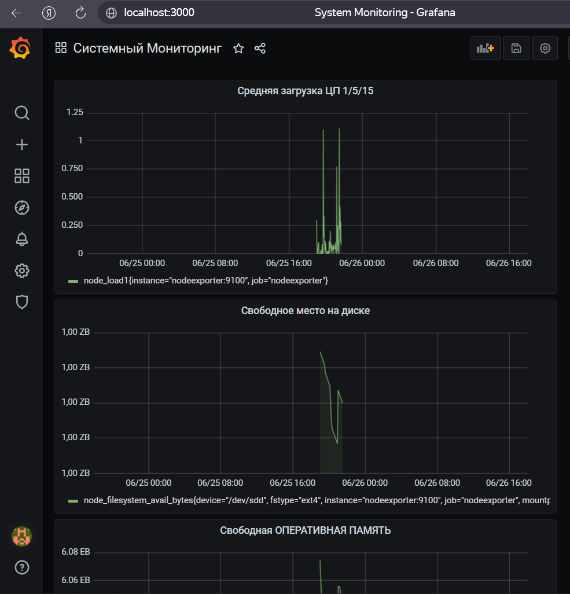
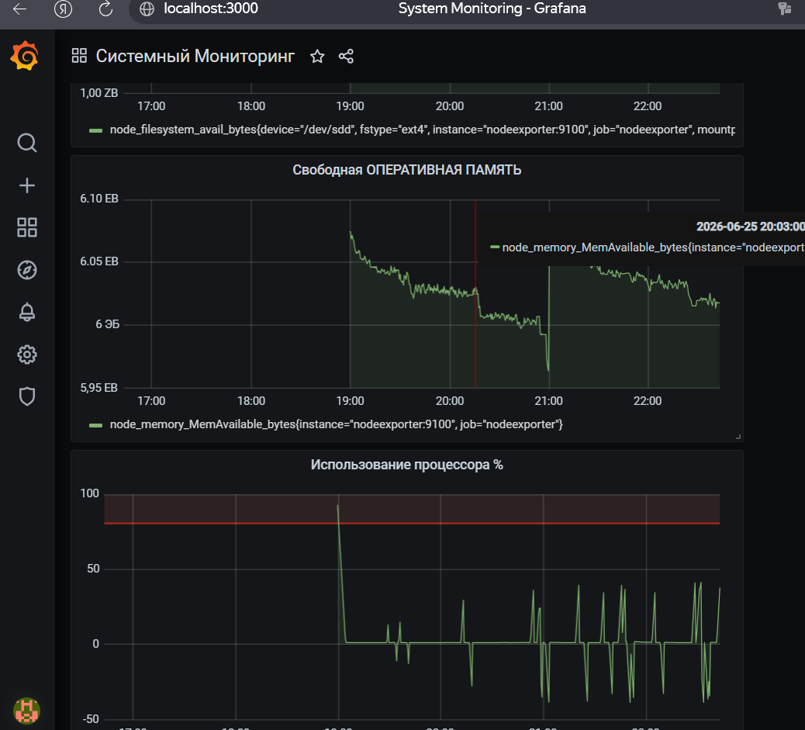

# Домашнее задание к занятию 14 «Средство визуализации Grafana»

## Задание 1
Подключите Prometheus как источник данных в Grafana.

**Решение:**
Источник данных добавлен по адресу `http://prometheus:9090`. Тест соединения успешен.

## Задание 2
Создайте Dashboard с панелями: утилизация CPU (%), CPU LA 1/5/15, свободная RAM, место на ФС.

**PromQL запросы:**
1. CPU Usage: `100 - (avg by(instance) (rate(node_cpu_seconds_total{mode="idle"}[5m])) * 100)`
2. CPU LA: `node_load1 or node_load5 or node_load15`
3. Free RAM: `node_memory_MemAvailable_bytes`
4. Disk Free: `node_filesystem_avail_bytes{mountpoint="/"}`

## Задание 3
Создайте правило alert для Dashboard.

**Решение:**
Создано правило `CPU Usage % alert`, которое срабатывает при загрузке CPU > 80% в течение 1 минуты.

## Задание 4
Сохраните ваш Dashboard в формате JSON.

**Решение:**
Модель дашборда сохранена в файле [dashboard.json](dashboard.json).
