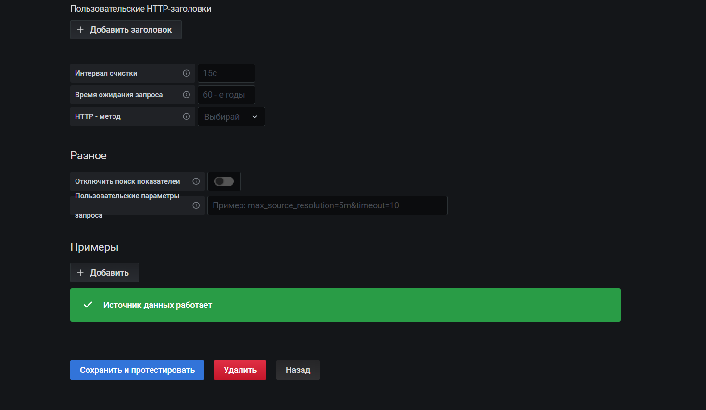
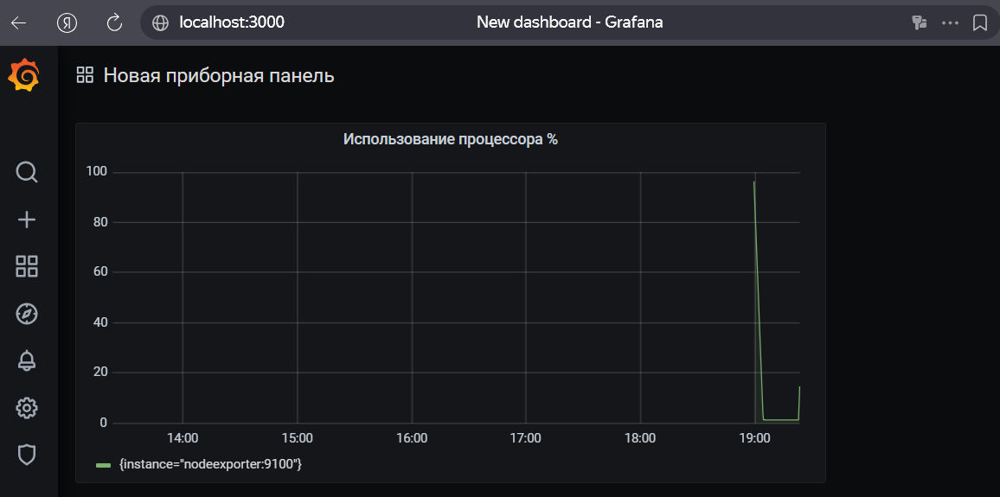
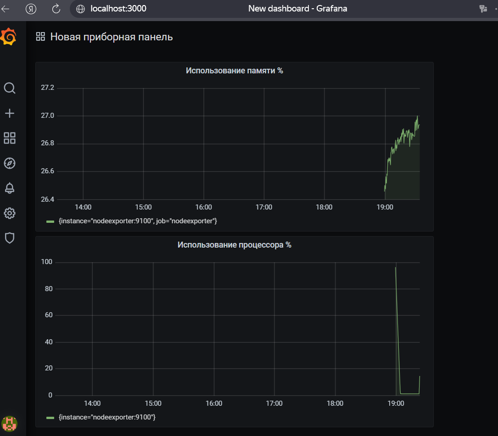
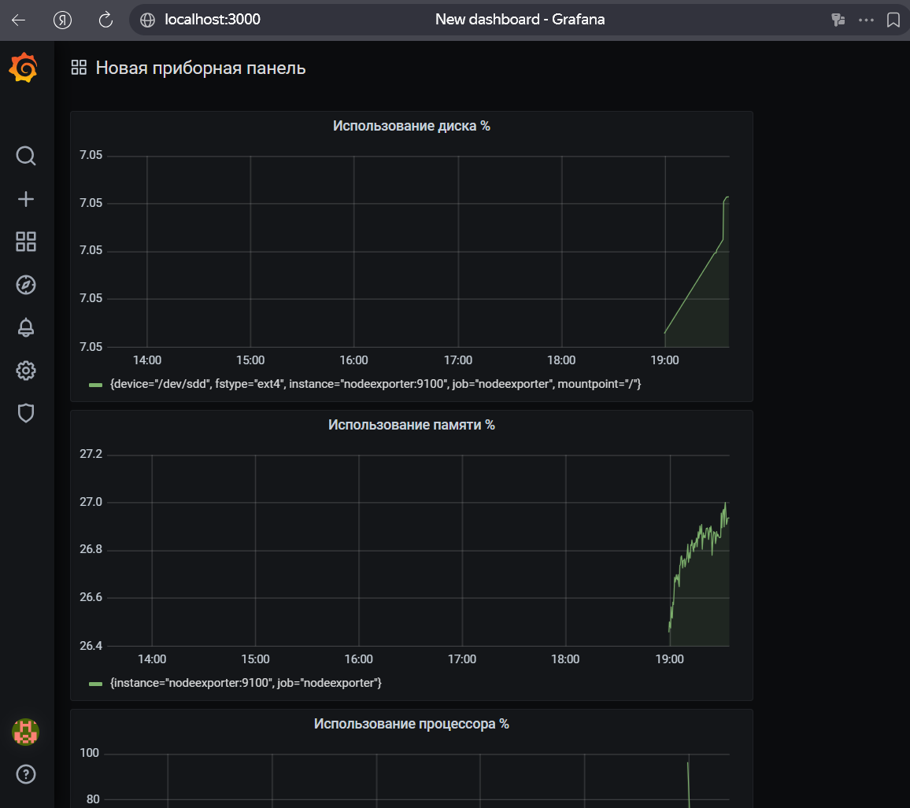

# Домашнее задание к занятию 14 «Средство визуализации Grafana»

## Задание 1
Подключите Prometheus как источник данных в Grafana.

**Ответ:**
Источник данных добавлен по адресу `http://prometheus:9090`. Тест соединения успешен.

## Задание 2
Создайте панель мониторинга загрузки процессора (CPU).

**Ответ:**
Добавлена панель с запросом:
`100 - (avg by(instance) (rate(node_cpu_seconds_total{mode="idle"}[5m])) * 100)`

## Задание 3
Добавьте панель мониторинга использования оперативной памяти (RAM).

**Ответ:**
Добавлена панель с запросом:
`(1 - (node_memory_MemAvailable_bytes / node_memory_MemTotal_bytes)) * 100`

## Задание 4
Добавьте панель мониторинга дискового пространства.

**Ответ:**
Добавлена панель с запросом:
`(1 - (node_filesystem_avail_bytes{mountpoint="/"} / node_filesystem_size_bytes{mountpoint="/"})) * 100`

